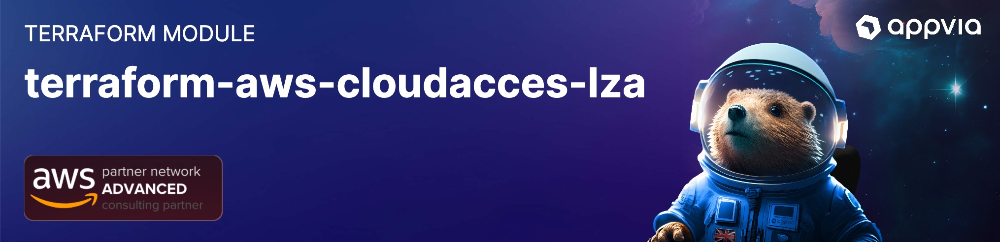

<!-- markdownlint-disable -->

<a href="https://www.appvia.io/"></a><br/><p align="right"> <a href="https://registry.terraform.io/modules/appvia/cloudaccess-lza/aws/latest"></a></a> <a href="https://github.com/appvia/terraform-aws-cloudaccess-lza/releases/latest"></a> <a href="https://appvia-community.slack.com/join/shared_invite/zt-1s7i7xy85-T155drryqU56emm09ojMVA#/shared-invite/email"></a> <a href="https://github.com/appvia/terraform-aws-cloudaccess-lza/graphs/contributors"></a><a href="https://img.shields.io/github/actions/workflow/status/appvia/terraform-aws-cloudaccess-lza/terraform.yml" alt="Release"></a>

# Terraform AWS Landing Zone Baseline

## Description

The purpose of this module is to provision the baseline requirements for a landing zone environment, and to provide a pattern moving forward for pipeline access.

## Usage

Add example usage here

```hcl
## Provision the Landing Zone Access permissions
module "landing_zone" {
  source  = "appvia/cloudaccess-lza/aws"
  version = "0.0.1"

  aws_accounts = {
    network    = var.aws_accounts["network"]
    management = var.aws_accounts["management"]
  }
  repositories = {
    accelerator_repository_url  = var.landing_zone_repositories.accelerator_repository_url
    connectivity_repository_url = var.landing_zone_repositories.connectivity_repository_url
    firewall_repository_url     = var.landing_zone_repositories.firewall_repository_url
    identity_repository_url     = var.landing_zone_repositories.identity_repository_url
  }
  tags = var.tags

  providers = {
    management = aws.management
    network    = aws.network
  }
}
```

## CIS Alarms & Notifications

This module can configure CIS alarms and notifications. To enable this functionality, set the `enable_cis_alarms` variable to `true`. These will use a CloudWatch log group, defaulting to the AWS Control Tower organizational trail. In order to receive notifications on this events

1. Use the `notifications_emails` variable to specify a list of email addresses to send notifications to.

```hcl
enable_cis_alarms = true
enable_email_notifications = true
notifications = {
  email = {
    addresses = ["security@example.com"]
  }
}
```

For notifications to slack

1. Configuration the notifications block accordingly

```hcl
enable_email_notifications = true
notifications = {
  slack = {
    webhook_url = "https://hooks.slack.com/services/..."
    channel = "cloud-notifications"
  }
}
accounts_id_to_name = {
  "1234567890" = "mgmt"
}
cloudwatch_log_group_retention = 3
identity_center_start_url = "<your identity center start url - if relevant>"
identity_center_role = "<your your identity center role - consistent across accounts typically read only - if relevant>"
```

## Tagging Enforcement

The tagging enforcement feature updates the default IAM boundaries deployed by this module to include additional policy blocking the creation of resources without the required tags; defined in the `var.enforcable_tags` variable. The restrictions will be applied to all actions found in the `var.enforcable_tagging_actions`. These are the same IAM boundaries which are intended to be used by machine roles (i.e. CI/CD).

Switching on the feature will also deploy a stackset across the entire organization implementing the tagging policy deny logic. This should be referenced by roles within the account.

The IAM policy which is used to enforce the tagging policy follows the below template

```yaml
- Sid: EnforceTaggingPolicy
  Effect: Deny
  Action:
    %{ for action in actions ~}
    - "${action}"
    %{ endfor ~}
  Resource: [
    %{ for resource in resources ~}
    - "${resource}"
    %{ endfor ~}
  Condition:
      Null:
        %{ for tag in tags ~}
        "aws:RequestTag/${tag}": "true"
        %{ endfor ~}
```

An example supplying the following tags - `Environment`, `Product`, `Owner`, `GitRepo` and using the default actions defined in the variables would render to.

```yaml
- Sid: EnforceTaggingPolicy
  Effect: Deny
  Action:
    - ec2:CreateInternetGateway
    - ec2:CreateVolume
    - ec2:CreateVpcPeeringConnection
    - ec2:RunInstances
    - ecs:CreateCluster
    - ecs:CreateService
    - ecs:CreateTaskSet
    - eks:CreateCluster
    - elasticfilesystem:CreateAccessPoint
    - elasticfilesystem:CreateFileSystem
    - elasticloadbalancing:CreateListener
    - elasticloadbalancing:CreateLoadBalancer
    - elasticloadbalancing:CreateRule
    - elasticloadbalancing:CreateTargetGroup
    - elasticloadbalancing:CreateTrustStore
    - network-firewall:CreateFirewall
    - network-firewall:CreateFirewallPolicy
    - network-firewall:CreateRuleGroup
    - ram:CreatePermission
    - ram:CreateResourceShare
    - redshift:CreateCluster
    - redshift:CreateClusterParameterGroup
    - redshift:CreateClusterSecurityGroup
    - redshift:CreateClusterSubnetGroup
    - route53:CreateHostedZone
    - secretsmanager:CreateSecret
  Resource: ["*"]
  Condition:
    Null:
      "aws:RequestTag/Environment": "true"
      "aws:RequestTag/Product": "true"
      "aws:RequestTag/Owner": "true"
      "aws:RequestTag/GitRepo": "true"
```

## Update Documentation

The `terraform-docs` utility is used to generate this README. Follow the below steps to update:

1. Make changes to the `.terraform-docs.yml` file
2. Fetch the `terraform-docs` binary (https://terraform-docs.io/user-guide/installation/)
3. Run `terraform-docs markdown table --output-file ${PWD}/README.md --output-mode inject .`

<!-- BEGIN_TF_DOCS -->
## Requirements

| Name | Version |
|------|---------|
| <a name="requirement_terraform"></a> [terraform](#requirement\_terraform) | >= 1.1.4 |
| <a name="requirement_archive"></a> [archive](#requirement\_archive) | ~> 2.0 |
| <a name="requirement_aws"></a> [aws](#requirement\_aws) | ~> 5.0 |

## Providers

| Name | Version |
|------|---------|
| <a name="provider_archive"></a> [archive](#provider\_archive) | 2.6.0 |
| <a name="provider_aws"></a> [aws](#provider\_aws) | 5.67.0 |
| <a name="provider_aws.audit"></a> [aws.audit](#provider\_aws.audit) | 5.67.0 |
| <a name="provider_aws.management"></a> [aws.management](#provider\_aws.management) | 5.67.0 |
| <a name="provider_aws.network"></a> [aws.network](#provider\_aws.network) | 5.67.0 |

## Modules

| Name | Source | Version |
|------|--------|---------|
| <a name="module_alarm_baseline"></a> [alarm\_baseline](#module\_alarm\_baseline) | appvia/alarm-baseline/aws | 0.2.5 |
| <a name="module_cost_management"></a> [cost\_management](#module\_cost\_management) | appvia/oidc/aws//modules/role | 1.3.2 |
| <a name="module_default_boundary"></a> [default\_boundary](#module\_default\_boundary) | appvia/boundary-stack/aws | 0.1.7 |
| <a name="module_management_landing_zone"></a> [management\_landing\_zone](#module\_management\_landing\_zone) | appvia/oidc/aws//modules/role | 1.3.2 |
| <a name="module_management_sso_identity"></a> [management\_sso\_identity](#module\_management\_sso\_identity) | appvia/oidc/aws//modules/role | 1.3.2 |
| <a name="module_network_inspection_vpc_admin"></a> [network\_inspection\_vpc\_admin](#module\_network\_inspection\_vpc\_admin) | appvia/oidc/aws//modules/role | 1.3.2 |
| <a name="module_network_transit_gateway_admin"></a> [network\_transit\_gateway\_admin](#module\_network\_transit\_gateway\_admin) | appvia/oidc/aws//modules/role | 1.3.2 |
| <a name="module_permissive_boundary"></a> [permissive\_boundary](#module\_permissive\_boundary) | appvia/boundary-stack/aws | 0.1.7 |
| <a name="module_securityhub_notifications"></a> [securityhub\_notifications](#module\_securityhub\_notifications) | appvia/notifications/aws | 1.0.4 |
| <a name="module_tagging_boundary"></a> [tagging\_boundary](#module\_tagging\_boundary) | appvia/boundary-stack/aws | 0.1.7 |

## Resources

| Name | Type |
|------|------|
| [aws_cloudformation_stack.aws_support_stack_instance_management_account](https://registry.terraform.io/providers/hashicorp/aws/latest/docs/resources/cloudformation_stack) | resource |
| [aws_cloudformation_stack_set.aws_support_stack](https://registry.terraform.io/providers/hashicorp/aws/latest/docs/resources/cloudformation_stack_set) | resource |
| [aws_cloudformation_stack_set.identity_stackset](https://registry.terraform.io/providers/hashicorp/aws/latest/docs/resources/cloudformation_stack_set) | resource |
| [aws_cloudformation_stack_set_instance.aws_support_stack_instance](https://registry.terraform.io/providers/hashicorp/aws/latest/docs/resources/cloudformation_stack_set_instance) | resource |
| [aws_cloudformation_stack_set_instance.identity_stack](https://registry.terraform.io/providers/hashicorp/aws/latest/docs/resources/cloudformation_stack_set_instance) | resource |
| [aws_cloudwatch_event_rule.securityhub_findings](https://registry.terraform.io/providers/hashicorp/aws/latest/docs/resources/cloudwatch_event_rule) | resource |
| [aws_cloudwatch_event_target.security_hub_findings_target](https://registry.terraform.io/providers/hashicorp/aws/latest/docs/resources/cloudwatch_event_target) | resource |
| [aws_cloudwatch_log_group.securityhub_lambda_log_group](https://registry.terraform.io/providers/hashicorp/aws/latest/docs/resources/cloudwatch_log_group) | resource |
| [aws_iam_group.breakglass](https://registry.terraform.io/providers/hashicorp/aws/latest/docs/resources/iam_group) | resource |
| [aws_iam_group_policy_attachment.breakglass](https://registry.terraform.io/providers/hashicorp/aws/latest/docs/resources/iam_group_policy_attachment) | resource |
| [aws_iam_group_policy_attachment.test-attach](https://registry.terraform.io/providers/hashicorp/aws/latest/docs/resources/iam_group_policy_attachment) | resource |
| [aws_iam_policy.breakglass](https://registry.terraform.io/providers/hashicorp/aws/latest/docs/resources/iam_policy) | resource |
| [aws_iam_policy.code_contributor](https://registry.terraform.io/providers/hashicorp/aws/latest/docs/resources/iam_policy) | resource |
| [aws_iam_policy.code_release](https://registry.terraform.io/providers/hashicorp/aws/latest/docs/resources/iam_policy) | resource |
| [aws_iam_policy.cost_iam_boundary](https://registry.terraform.io/providers/hashicorp/aws/latest/docs/resources/iam_policy) | resource |
| [aws_iam_policy.costs_admin](https://registry.terraform.io/providers/hashicorp/aws/latest/docs/resources/iam_policy) | resource |
| [aws_iam_policy.costs_viewer](https://registry.terraform.io/providers/hashicorp/aws/latest/docs/resources/iam_policy) | resource |
| [aws_iam_policy.ipam_admin](https://registry.terraform.io/providers/hashicorp/aws/latest/docs/resources/iam_policy) | resource |
| [aws_iam_policy.user_management](https://registry.terraform.io/providers/hashicorp/aws/latest/docs/resources/iam_policy) | resource |
| [aws_iam_role.securityhub_lambda_role](https://registry.terraform.io/providers/hashicorp/aws/latest/docs/resources/iam_role) | resource |
| [aws_iam_user.breakglass](https://registry.terraform.io/providers/hashicorp/aws/latest/docs/resources/iam_user) | resource |
| [aws_iam_user_group_membership.breakglass](https://registry.terraform.io/providers/hashicorp/aws/latest/docs/resources/iam_user_group_membership) | resource |
| [aws_lambda_function.securityhub_lambda_function](https://registry.terraform.io/providers/hashicorp/aws/latest/docs/resources/lambda_function) | resource |
| [aws_lambda_permission.securityhub_event_bridge](https://registry.terraform.io/providers/hashicorp/aws/latest/docs/resources/lambda_permission) | resource |
| [archive_file.securityhub_lambda_package](https://registry.terraform.io/providers/hashicorp/archive/latest/docs/data-sources/file) | data source |
| [aws_caller_identity.current](https://registry.terraform.io/providers/hashicorp/aws/latest/docs/data-sources/caller_identity) | data source |
| [aws_iam_policy_document.breakglass](https://registry.terraform.io/providers/hashicorp/aws/latest/docs/data-sources/iam_policy_document) | data source |
| [aws_iam_policy_document.lambda_assume_role_policy](https://registry.terraform.io/providers/hashicorp/aws/latest/docs/data-sources/iam_policy_document) | data source |
| [aws_iam_policy_document.securityhub_lambda_cloudwatch_logs_policy](https://registry.terraform.io/providers/hashicorp/aws/latest/docs/data-sources/iam_policy_document) | data source |
| [aws_iam_policy_document.securityhub_notifications_policy](https://registry.terraform.io/providers/hashicorp/aws/latest/docs/data-sources/iam_policy_document) | data source |
| [aws_kms_alias.securityhub_kms_key](https://registry.terraform.io/providers/hashicorp/aws/latest/docs/data-sources/kms_alias) | data source |
| [aws_organizations_organization.current](https://registry.terraform.io/providers/hashicorp/aws/latest/docs/data-sources/organizations_organization) | data source |
| [aws_region.current](https://registry.terraform.io/providers/hashicorp/aws/latest/docs/data-sources/region) | data source |

## Inputs

| Name | Description | Type | Default | Required |
|------|-------------|------|---------|:--------:|
| <a name="input_accounts_id_to_name"></a> [accounts\_id\_to\_name](#input\_accounts\_id\_to\_name) | A mapping of account id and account name - used by notification lamdba to map an account ID to a human readable name | `map(string)` | `{}` | no |
| <a name="input_aws_accounts"></a> [aws\_accounts](#input\_aws\_accounts) | Map of AWS account names to their account IDs | <pre>object({<br/>    network_account_id      = optional(string, "")<br/>    remoteaccess_account_id = optional(string, "")<br/>  })</pre> | n/a | yes |
| <a name="input_aws_support_role_name"></a> [aws\_support\_role\_name](#input\_aws\_support\_role\_name) | Name of the AWS Support role | `string` | `"AWSSupportAccessRole"` | no |
| <a name="input_breakglass_users"></a> [breakglass\_users](#input\_breakglass\_users) | The number of breakglass users to create | `number` | `2` | no |
| <a name="input_cloudaccess_terraform_state_ro_policy_name"></a> [cloudaccess\_terraform\_state\_ro\_policy\_name](#input\_cloudaccess\_terraform\_state\_ro\_policy\_name) | Name of the IAM policy to attach to the CloudAccess Terraform state role | `string` | `"lza-cloudaccess-tfstate-ro"` | no |
| <a name="input_cloudaccess_terraform_state_rw_policy_name"></a> [cloudaccess\_terraform\_state\_rw\_policy\_name](#input\_cloudaccess\_terraform\_state\_rw\_policy\_name) | Name of the IAM policy to attach to the CloudAccess Terraform state role | `string` | `"lza-cloudaccess-tfstate-rw"` | no |
| <a name="input_cloudwatch_identity_center_role"></a> [cloudwatch\_identity\_center\_role](#input\_cloudwatch\_identity\_center\_role) | The name of the role to use when redirecting through Identity Center for cloudwatch events | `string` | `null` | no |
| <a name="input_costs_boundary_name"></a> [costs\_boundary\_name](#input\_costs\_boundary\_name) | Name of the IAM policy to use as a permissions boundary for cost-related roles | `string` | `"lza-costs-boundary"` | no |
| <a name="input_default_permissions_boundary_name"></a> [default\_permissions\_boundary\_name](#input\_default\_permissions\_boundary\_name) | Name of the default IAM policy to use as a permissions boundary | `string` | `"lza-default-boundary"` | no |
| <a name="input_enable_aws_support"></a> [enable\_aws\_support](#input\_enable\_aws\_support) | Indicates if we should enable AWS Support role | `bool` | `true` | no |
| <a name="input_enable_breakglass"></a> [enable\_breakglass](#input\_enable\_breakglass) | Indicates if we should enable breakglass users and group | `bool` | `false` | no |
| <a name="input_enable_cis_alarms"></a> [enable\_cis\_alarms](#input\_enable\_cis\_alarms) | Indicates if we should enable CIS alerts | `bool` | `true` | no |
| <a name="input_enable_securityhub_alarms"></a> [enable\_securityhub\_alarms](#input\_enable\_securityhub\_alarms) | Indicates if we should enable SecurityHub alarms | `bool` | `true` | no |
| <a name="input_enforcable_tagging_actions"></a> [enforcable\_tagging\_actions](#input\_enforcable\_tagging\_actions) | List of enforceable tagging actions | `list(string)` | <pre>[<br/>  "ec2:CreateInternetGateway",<br/>  "ec2:CreateVolume",<br/>  "ec2:CreateVpcPeeringConnection",<br/>  "ec2:RunInstances",<br/>  "ecs:CreateCluster",<br/>  "ecs:CreateService",<br/>  "ecs:CreateTaskSet",<br/>  "eks:CreateCluster",<br/>  "elasticfilesystem:CreateAccessPoint",<br/>  "elasticfilesystem:CreateFileSystem",<br/>  "elasticloadbalancing:CreateListener",<br/>  "elasticloadbalancing:CreateLoadBalancer",<br/>  "elasticloadbalancing:CreateRule",<br/>  "elasticloadbalancing:CreateTargetGroup",<br/>  "elasticloadbalancing:CreateTrustStore",<br/>  "network-firewall:CreateFirewall",<br/>  "network-firewall:CreateFirewallPolicy",<br/>  "network-firewall:CreateRuleGroup",<br/>  "ram:CreatePermission",<br/>  "ram:CreateResourceShare",<br/>  "redshift:CreateCluster",<br/>  "redshift:CreateClusterParameterGroup",<br/>  "redshift:CreateClusterSecurityGroup",<br/>  "redshift:CreateClusterSubnetGroup",<br/>  "route53:CreateHostedZone",<br/>  "secretsmanager:CreateSecret"<br/>]</pre> | no |
| <a name="input_enforcable_tagging_policy_name"></a> [enforcable\_tagging\_policy\_name](#input\_enforcable\_tagging\_policy\_name) | Name of the IAM policy to use as a permissions boundary for enforceable tags | `string` | `"lza-enforceable-tags-boundary"` | no |
| <a name="input_enforcable_tagging_resources"></a> [enforcable\_tagging\_resources](#input\_enforcable\_tagging\_resources) | List of enforceable tagging resources | `list(string)` | <pre>[<br/>  "*"<br/>]</pre> | no |
| <a name="input_enforcable_tags"></a> [enforcable\_tags](#input\_enforcable\_tags) | List of enforceable tags | `list(string)` | `[]` | no |
| <a name="input_identity_center_start_url"></a> [identity\_center\_start\_url](#input\_identity\_center\_start\_url) | The start URL of your Identity Center instance | `string` | `null` | no |
| <a name="input_notifications"></a> [notifications](#input\_notifications) | Configuration for the notifications | <pre>object({<br/>    email = optional(object({<br/>      addresses = list(string)<br/>    }), null)<br/>    slack = optional(object({<br/>      webhook_url = string<br/>    }), null)<br/>    teams = optional(object({<br/>      webhook_url = string<br/>    }), null)<br/>  })</pre> | <pre>{<br/>  "email": {<br/>    "addresses": []<br/>  },<br/>  "slack": null,<br/>  "teams": null<br/>}</pre> | no |
| <a name="input_permissive_permissions_boundary_name"></a> [permissive\_permissions\_boundary\_name](#input\_permissive\_permissions\_boundary\_name) | Name of the permissive IAM policy to use as a permissions boundary | `string` | `"lza-permissive-boundary"` | no |
| <a name="input_repositories"></a> [repositories](#input\_repositories) | List of repository locations for the pipelines | <pre>object({<br/>    accelerator = optional(object({<br/>      url       = string<br/>      role_name = optional(string, "lza-accelerator")<br/>    }), null)<br/>    connectivity = optional(object({<br/>      url       = string<br/>      role_name = optional(string, "lza-connectivity")<br/>    }), null)<br/>    cost_management = optional(object({<br/>      url       = string<br/>      role_name = optional(string, "lza-cost-management")<br/>    }), null)<br/>    firewall = optional(object({<br/>      url       = string<br/>      role_name = optional(string, "lza-firewall")<br/>    }), null)<br/>    identity = optional(object({<br/>      url       = string<br/>      role_name = optional(string, "lza-identity")<br/>    }), null)<br/>  })</pre> | `{}` | no |
| <a name="input_scm_name"></a> [scm\_name](#input\_scm\_name) | Name of the source control management system (github or gitlab) | `string` | `"github"` | no |
| <a name="input_security_hub_identity_center_role"></a> [security\_hub\_identity\_center\_role](#input\_security\_hub\_identity\_center\_role) | The name of the role to use when redirecting through Identity Center for security hub events | `string` | `null` | no |
| <a name="input_securityhub_event_bridge_rule_name"></a> [securityhub\_event\_bridge\_rule\_name](#input\_securityhub\_event\_bridge\_rule\_name) | Display name of the EventBridge rule for Security Hub findings | `string` | `"lza-securityhub-alerts"` | no |
| <a name="input_securityhub_lambda_function_name"></a> [securityhub\_lambda\_function\_name](#input\_securityhub\_lambda\_function\_name) | Name of the Security Hub Lambda function | `string` | `"lza-securityhub-lambda-forwarder"` | no |
| <a name="input_securityhub_lambda_log_group_kms_alias"></a> [securityhub\_lambda\_log\_group\_kms\_alias](#input\_securityhub\_lambda\_log\_group\_kms\_alias) | Name of the KMS alias for the CloudWatch log group | `string` | `"alias/accelerator/kms/cloudwatch/key"` | no |
| <a name="input_securityhub_lambda_role_name"></a> [securityhub\_lambda\_role\_name](#input\_securityhub\_lambda\_role\_name) | Name of the IAM role for the Security Hub Lambda function | `string` | `"lza-securityhub-lambda-role"` | no |
| <a name="input_securityhub_lambda_runtime"></a> [securityhub\_lambda\_runtime](#input\_securityhub\_lambda\_runtime) | Runtime for the Security Hub Lambda function | `string` | `"python3.12"` | no |
| <a name="input_securityhub_severity_filter"></a> [securityhub\_severity\_filter](#input\_securityhub\_severity\_filter) | Indicates if we should enable SecurityHub | `list(string)` | <pre>[<br/>  "CRITICAL",<br/>  "HIGH"<br/>]</pre> | no |
| <a name="input_securityhub_sns_topic_name"></a> [securityhub\_sns\_topic\_name](#input\_securityhub\_sns\_topic\_name) | Name of the SNS topic to send Security Hub findings to | `string` | `"lza-securityhub-alerts"` | no |
| <a name="input_tags"></a> [tags](#input\_tags) | Tags to apply to all resources | `map(string)` | n/a | yes |

## Outputs

| Name | Description |
|------|-------------|
| <a name="output_cloudaccess_terraform_state_ro_policy_name"></a> [cloudaccess\_terraform\_state\_ro\_policy\_name](#output\_cloudaccess\_terraform\_state\_ro\_policy\_name) | Name of the IAM policy to attach to the CloudAccess Terraform state role |
| <a name="output_cloudaccess_terraform_state_rw_policy_name"></a> [cloudaccess\_terraform\_state\_rw\_policy\_name](#output\_cloudaccess\_terraform\_state\_rw\_policy\_name) | Name of the IAM policy to attach to the CloudAccess Terraform state role |
| <a name="output_default_permission_boundary_name"></a> [default\_permission\_boundary\_name](#output\_default\_permission\_boundary\_name) | The name of the default permissions iam boundary |
| <a name="output_default_permissive_boundary_name"></a> [default\_permissive\_boundary\_name](#output\_default\_permissive\_boundary\_name) | The name of the default permissive iam boundary |
| <a name="output_identity_role_ro_name"></a> [identity\_role\_ro\_name](#output\_identity\_role\_ro\_name) | The name of the IAM readonly role which can be assumed by the identity stack in all accounts |
| <a name="output_identity_role_rw_name"></a> [identity\_role\_rw\_name](#output\_identity\_role\_rw\_name) | The name of the IAM readwrite role which can be assumed by the identity stack in all accounts |
| <a name="output_identity_stack_name"></a> [identity\_stack\_name](#output\_identity\_stack\_name) | The name of the identity stack |
<!-- END_TF_DOCS -->
